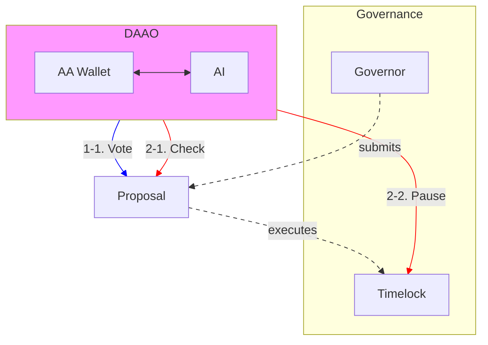

# DAAO: Decentralized AI-Powered Autonomous Organization

Welcome to DAAO, a cutting-edge Decentralized AI-Powered Autonomous Organization that aims to transform blockchain governance by integrating AI for enhanced security, reliability, and community engagement.
This system addresses challenges such as low voter turnout and malicious proposals, ensuring robust and reliable decision-making.

## Main Features

**AI-Driven Automated Voting System**: Automatically analyzes user preferences through on-chain activity and social media data, predicting and casting votes on behalf of users. This system ensures continuous participation, reducing the risks associated with low voter turnout and malicious proposals.

**AI-Based Proposal Validation**: Implements an AI validation step post-vote to ensure alignment between community sentiment and vote outcomes. If discrepancies are detected, the proposal execution is paused, allowing for further discussion and preventing potential harm.

**Account Abstraction Integration**: Utilizes Account Abstraction to allow AI agents to execute governance transactions securely by direct transaction execution.

**Multi-Layer 2 Support**: DAAO is fully operational on multiple Layer 2 networks, now including Optimism, Base, and Metal L2.

## 🛠 Projects and Repositories

DAAO's ecosystem includes various projects and smart contracts focused on enhancing governance participation, AI-driven decision-making, and secure execution processes.

### 🤖 AI

**Predictive Voting through AA**: [https://github.com/CP-DAAO/DAAO-AA](https://github.com/CP-DAAO/DAAO-AA)
**AI-powered Proposal Execution Checker**: [https://github.com/CP-DAAO/DAAO-judge](https://github.com/CP-DAAO/DAAO-judge)

### ⚙️ Contracts

**Governor Contracts**: [https://github.com/CP-DAAO/DAAO-contracts](https://github.com/CP-DAAO/DAAO-contracts)
**Account Abstraction Wallet**: [https://github.com/CP-DAAO/DAAO-AA](https://github.com/CP-DAAO/DAAO-AA)

---

Explore more about DAAO through the following links:
- [DAAO on Optimism](https://www.tally.xyz/gov/daao-op)
- [DAAO on Base](https://www.tally.xyz/gov/daao-base)
- [DAAO on Metal L2 (Explorer)](https://testnet.explorer.metall2.com/address/0xAb563D95Aeb44aA2aa4FD49Bb7915E7C55CdEeB9)
